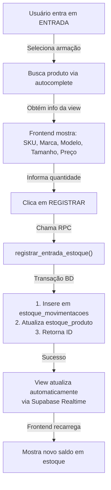

# 🏢 ANÁLISE COMPLETA - SIS_Estoque (Sistema de Controle de Estoque e Produtos)

**Data:** 17 de Janeiro de 2026  
**Status:** ✅ Análise Concluída  
**Objetivo:** Integração com Desenrola DCL para controle de armações + lentes + peças

---

## 📋 ÍNDICE

1. [Arquitetura Geral](#arquitetura-geral)
2. [Stack Tecnológico](#stack-tecnológico)
3. [Estrutura de Banco de Dados](#estrutura-de-banco-de-dados)
4. [Services e APIs](#services-e-apis)
5. [Rotas e Funcionalidades](#rotas-e-funcionalidades)
6. [Modelos de Dados (TypeScript)](#modelos-de-dados-typescript)
7. [RPCs Disponíveis](#rpcs-disponíveis)
8. [Fluxo de Movimentações](#fluxo-de-movimentações)
9. [Considerações para Integração](#considerações-para-integração)

---

## 🏗️ ARQUITETURA GERAL

### **Visão Geral do Sistema**

O `SIS_Estoque` é um **sistema multi-loja de gestão de estoque** construído em **SvelteKit + Supabase + PostgreSQL**, com foco em:

```
┌─────────────────────────────────────────────────────────┐
│                    SIS_ESTOQUE                          │
├─────────────────────────────────────────────────────────┤
│  Frontend: SvelteKit (Svelte 5.x)                       │
│  Backend: Supabase (Postgre SQL)                        │
│  UI: Tailwind CSS + Lucide Icons                        │
│  Estado: Svelte Stores (Reativos)                       │
│  Autenticação: Supabase Auth                            │
└─────────────────────────────────────────────────────────┘
         ↓                    ↓                    ↓
    ┌────────────┐     ┌────────────┐     ┌────────────┐
    │ Produtos   │     │  Estoque   │     │ Lojas      │
    │ (Catálogo) │     │ (Físico)   │     │ (Multi)    │
    └────────────┘     └────────────┘     └────────────┘
```

### **Conceito Principal: Catálogo vs Estoque**

| Aspecto          | Produtos                                | Estoque                           |
| ---------------- | --------------------------------------- | --------------------------------- |
| **O que é**      | Catálogo histórico (tudo que já entrou) | Unidades reais disponíveis AGORA  |
| **Tabela**       | `produtos`                              | `estoque_produto`                 |
| **Registro por** | Produto único                           | Produto + Loja + Tamanho          |
| **Dados**        | SKU, marca, modelo, cor, preço          | Quantidade, valor, localização    |
| **Histórico**    | `estoque_movimentacoes`                 | Rastreamento de cada movimentação |

---

## 🛠️ STACK TECNOLÓGICO

### **Frontend (SvelteKit)**

```json
{
  "framework": "SvelteKit 2.49.1",
  "language": "TypeScript 5.9",
  "styling": "Tailwind CSS 4.1",
  "icons": "lucide-svelte",
  "barcode": "jsbarcode + qrcode",
  "date": "date-fns",
  "validation": "zod"
}
```

### **Backend (Supabase)**

```json
{
  "database": "PostgreSQL",
  "auth": "Supabase Auth",
  "storage": "Supabase Storage",
  "realtime": "PostgreSQL Realtime",
  "functions": "RPC (Remote Procedure Calls)"
}
```

### **Padrões de Estado**

- **Svelte Stores**: Reactivity built-in (`auth.svelte.ts`, `theme.svelte.ts`)
- **Impressão Centralizada**: `impressao.svelte.ts` (estoque para etiquetas)
- **Toast Global**: Sistema de notificações

---

## 🗄️ ESTRUTURA DE BANCO DE DADOS

### **Tabelas Principais**

#### 1️⃣ **`produtos`** - Catálogo Completo

```sql
┌─────────────────────────────────────────────────────────┐
│                    PRODUTOS                             │
├──────────────────┬──────────────────┬──────────────────┤
│ id (UUID)        │ sku (UNIQUE)     │ sku_visual       │
│ descricao        │ tipo             │ categoria_id     │
│ marca_id         │ modelo_id        │ cor_id           │
│ familia_id       │ tamanho          │ custo            │
│ preco_venda      │ markup           │ fornecedor_id    │
│ classificacao    │ status           │ ativo            │
│ pode_lente_grau  │ is_exclusivo     │ is_pre_venda     │
│ nivel_critico    │ nivel_ideal      │ lead_time        │
│ giro_medio       │ created_at       │ updated_at       │
└──────────────────┴──────────────────┴──────────────────┘

Campos importantes para LENTES E ARMAÇÕES:
  • tipo: 'armacao' | 'acessorio' | 'lente' | 'servico'
  • tamanho: Para armações (ex: 52, 54); Para lentes (esferico)
  • pode_lente_grau: true para armações, false para acessórios
  • classificacao_fiscal: NCM para NF-e
  • fornecedor_id: Vinculado à tabela fornecedores
```

#### 2️⃣ **`estoque_produto`** - Estoque Físico por Loja

```sql
┌─────────────────────────────────────────────────────────┐
│              ESTOQUE_PRODUTO                            │
├──────────────────┬──────────────────┬──────────────────┤
│ id (UUID)        │ produto_id       │ loja_id          │
│ tamanho          │ quantidade       │ quantidade_min   │
│ quantidade_max   │ valor_unitario   │ localizacao      │
│ created_at       │ updated_at       │                  │
└──────────────────┴──────────────────┴──────────────────┘

Chave composta: (produto_id, loja_id, tamanho)
Permite: Mesmos produtos com estoque diferente por loja
```

#### 3️⃣ **`estoque_movimentacoes`** - Histórico Completo

```sql
┌─────────────────────────────────────────────────────────┐
│          ESTOQUE_MOVIMENTACOES                          │
├──────────────────┬──────────────────┬──────────────────┤
│ id (UUID)        │ produto_id       │ loja_id          │
│ tipo             │ tipo_movimentacao│ quantidade       │
│ quantidade_ant   │ quantidade_atual │ valor_unitario   │
│ valor_total      │ data_movimento   │ motivo           │
│ documento_ref    │ nota_fiscal      │ fornecedor_id    │
│ usuario_id       │ status           │ lote             │
│ created_at       │                  │                  │
└──────────────────┴──────────────────┴──────────────────┘

tipos: 'entrada' | 'saida'
tipo_movimentacao: 'compra' | 'venda' | 'ajuste' | 'perda' | 'dano'
Auditoria completa de quem movimentou, quando e por quê
```

#### 4️⃣ **`lojas`** - Estrutura Multi-loja

```sql
┌─────────────────────────────────────────────────────────┐
│                      LOJAS                              │
├──────────────────┬──────────────────┬──────────────────┤
│ id (UUID)        │ nome             │ cnpj             │
│ endereco         │ cidade           │ estado           │
│ cep              │ telefone         │ email            │
│ ativo            │ created_at       │                  │
└──────────────────┴──────────────────┴──────────────────┘

Cada loja = Estoque independente
```

#### 5️⃣ **Tabelas de Catálogo** (Lookup)

```sql
marcas           categorias         cores
├─ id (UUID)     ├─ id (UUID)      ├─ id (UUID)
├─ nome          ├─ nome           ├─ nome
├─ codigo        ├─ codigo         ├─ codigo_hex
└─ created_at    └─ created_at     └─ created_at

Outras:
├─ modelos       (id, nome, codigo)
├─ familias      (id, nome)
├─ fornecedores  (id, nome, cnpj, contato)
```

#### 6️⃣ **`inventarios` e `inventario_itens`** - Controle Físico

```sql
Permite fazer inventários cíclicos ou completos
├─ inventario_id
├─ produto_id
├─ quantidade_sistema
├─ quantidade_contada
├─ diferenca
└─ anotacoes
```

---

## 📡 SERVICES E APIs

### **Service Structure** (`src/lib/services/`)

#### 1. **`produtos.service.ts`** - Gerenciamento de Produtos

```typescript
// Listar produtos com estoque completo
produtosService.listar(filtros: ProdutoFiltros)
// Buscar por ID, SKU
produtosService.buscarPorId(id)
produtosService.buscarPorSku(sku)
// Buscar para autocomplete
produtosService.buscar(termo, limit=20)
// Estoque crítico/sem estoque
produtosService.estoqueCritico()
produtosService.semEstoque()
// CRUD
produtosService.criar(produto)
produtosService.atualizar(id, produto)
produtosService.deletar(id) // soft delete
// Lookup tables
produtosService.getMarcas()
produtosService.getCategorias()
produtosService.getCores()
```

**Key Feature:** Agregação automática de múltiplos tamanhos para evitar duplicatas no frontend

#### 2. **`estoque.service.ts`** - Movimentações

```typescript
// Consultas
estoqueService.listarPorLoja(loja_id);
estoqueService.saldoProduto(produto_id);
estoqueService.listarMovimentacoes({ loja_id, limit });
estoqueService.estatisticasMovimentacoes(loja_id, (dias = 30));

// MOVIMENTAÇÕES (RPCs)
estoqueService.registrarEntrada({
  produto_id,
  loja_id,
  quantidade,
  valor_unitario,
  tipo_movimentacao: "compra" | "ajuste",
  motivo,
  observacoes,
  documento,
  fornecedor_id,
  tamanho, // ⭐ IMPORTANTE para armações
});

estoqueService.registrarSaida({
  produto_id,
  loja_id,
  quantidade,
  tipo_movimentacao: "venda" | "dano" | "perda",
  motivo: string,
  observacoes,
  documento,
  tamanho, // ⭐ IMPORTANTE
});

// Transferência entre lojas
estoqueService.transferirProduto({
  produto_id,
  loja_origem,
  loja_destino,
  quantidade,
});
```

#### 3. **`lojas.service.ts`** - Gestão de Lojas

```typescript
lojasService.listar();
lojasService.buscarPorId(id);
```

#### 4. **`impressao.service.ts`** - Etiquetas e Impressoras

```typescript
// Sistema completo de impressão de etiquetas com diferentes formatos
impressaoService.imprimirEtiqueta(config);
impressaoService.imprimirCodigoBarras(config);
impressaoService.enviarImpressora(dados);
```

---

## 🛣️ ROTAS E FUNCIONALIDADES

### **Estrutura de Rotas** (`src/routes/(app)/`)

```
/dashboard          → KPIs, gráficos de estoque
/produtos           → Catálogo completo com estoque
/armacoes           → Vista especializada para armações
/entrada            → Registrar entrada de mercadorias
/saida              → Registrar saída/venda
/ajuste             → Ajustes manuais de estoque
/transferencia      → Mover estoque entre lojas
/inventario         → Controle de inventário cíclico
/movimentacoes      → Histórico completo de movimentos
/analytics          → Análises (Curva ABC, Giro, Margem)
  ├─ /curva-abc     → Produtos A/B/C
  ├─ /giro          → Velocidade de saída
  └─ /margem        → Análise de lucratividade
/relatorios         → Relatórios customizados
/impressao          → Gestão de impressoras e etiquetas
  ├─ /armacoes      → Imprimir código de armações
  ├─ /acessorios    → Imprimir código de acessórios
  └─ /relatorios    → Relatórios de impressão
/configuracoes      → Admin
  ├─ /lojas         → Gerenciar lojas
  ├─ /usuarios      → Gestão de usuários
  └─ /impressora    → Configurar impressoras
```

---

## 📝 MODELOS DE DADOS (TypeScript)

### **Tipo: `Produto`**

```typescript
interface Produto {
  id: string;
  sku: string; // Código técnico
  sku_visual: string | null; // Código curto (ex: MO123456)
  sku_num: string | null;
  cod: string | null;
  tamanho: string | null; // ⭐ Para armações (52, 54, etc)
  descricao: string;
  custo: number | null;
  markup: number | null;
  preco_venda: number | null;
  classificacao_fiscal: string | null; // NCM
  status: string | null;
  pode_lente_grau: boolean | null; // ⭐ Flag importante
  is_exclusivo: boolean | null;
  is_pre_venda: boolean | null;
  is_novidade: boolean | null;
  categoria_id: string | null;
  modelo_id: string | null;
  cor_id: string | null;
  marca_id: string | null;
  familia_id: string | null;
  fornecedor_id: string | null;
  tipo: string | null; // 'armacao' | 'acessorio' | 'lente'
  observacoes: string | null;
  ativo: boolean | null;
  nivel_critico: number | null; // Ponto de pedido
  nivel_ideal: number | null; // Meta de estoque
  lead_time: number | null; // Dias para repor
  giro_medio: number | null; // Velocidade de saída
  created_at: string;
}
```

### **Tipo: `EstoqueProduto`**

```typescript
interface EstoqueProduto {
  id: string;
  produto_id: string;
  loja_id: string;
  tamanho: string | null; // ⭐ Pode variar por tamanho
  quantidade: number;
  quantidade_minima: number;
  quantidade_maxima: number;
  valor_unitario: number | null;
  localizacao: string; // Ex: "Prateleira A5"
  created_at: string;
  updated_at: string;
}
```

### **Tipo: `EstoqueMovimentacao`**

```typescript
interface EstoqueMovimentacao {
  id: string;
  produto_id: string;
  loja_id: string | null;
  tipo: "entrada" | "saida";
  tipo_movimentacao: string | null; // 'compra'|'venda'|'ajuste'|'perda'|'dano'
  quantidade: number;
  quantidade_anterior: number | null;
  quantidade_atual: number | null;
  valor_unitario: number | null;
  valor_total: number | null;
  data_movimentacao: string;
  motivo: string | null;
  observacao: string | null;
  documento_referencia: string | null;
  nota_fiscal: string | null;
  fornecedor_id: string | null;
  usuario_id: string | null;
  status: string | null;
  sku_num: string | null;
  lote: string | null;
}
```

### **Views Principais**

#### `vw_estoque_completo` - A view mais usada

```typescript
interface VwEstoqueCompleto {
  produto_id: string;
  sku: string;
  sku_visual: string | null;
  nome: string; // Campo = 'descricao' (mapeado no service)
  custo: number | null;
  preco_venda: number | null;
  quantidade_atual: number; // ⭐ Agregada por loja
  nivel_critico: number | null;
  nivel_ideal: number | null;
  lead_time: number | null;
  giro_medio: number | null;
  is_exclusivo: boolean | null;
  is_novidade: boolean | null;
  categoria_id: string | null;
  modelo_id: string | null;
  cor_id: string | null;
  marca_id: string | null;
  familia_id: string | null;
  valor_total: number | null; // quantidade_atual × custo
  custo_total: number | null;
  status_estoque: string | null; // 'esgotado'|'critico'|'normal'|'sem_estoque'
  percentual_nivel_critico: number | null;
}
```

#### `vw_movimentacoes_lista` - Histórico com JOINs

```typescript
interface VwMovimentacoesLista {
  id: string;
  produto_id: string;
  loja_id: string;
  tipo: "entrada" | "saida";
  quantidade: number;
  quantidade_anterior: number;
  quantidade_atual: number;
  valor_total: number | null;
  data_movimentacao: string;
  motivo: string | null;
  // Produto como objeto JSON (sem novo JOIN)
  produto: { id: string; sku: string; nome: string } | null;
}
```

---

## ⚙️ RPCs DISPONÍVEIS

### **RPC: `registrar_entrada_estoque`**

```typescript
// Entrada de mercadorias do fornecedor
async registrarEntrada({
  p_produto_id: UUID,
  p_quantidade: INT,
  p_loja_id: UUID,
  p_tipo: STRING,                    // 'entrada_compra' | 'entrada_ajuste'
  p_documento: STRING | NULL,
  p_fornecedor: UUID | NULL,
  p_valor_unitario: NUMERIC,
  p_motivo: STRING,
  p_observacao: STRING,
  p_tamanho: STRING | NULL            // ⭐ Suporta tamanho/haste
})

Retorna:
{
  id: string;                         // ID da movimentação criada
  quantidade_anterior: number;
  quantidade_atual: number;
}
```

**Flow:**

1. Busca saldo atual em `estoque_produto`
2. Insere registro em `estoque_movimentacoes`
3. Cria/atualiza registro em `estoque_produto`
4. Retorna ID da movimentação

### **RPC: `registrar_saida_estoque`**

```typescript
// Saída por venda, perda ou dano
async registrarSaida({
  p_produto_id: UUID,
  p_quantidade: INT,
  p_loja_id: UUID,
  p_tipo: STRING,                    // 'saida_venda' | 'saida_perda' | 'saida_dano'
  p_motivo: STRING,
  p_observacao: STRING,
  p_tamanho: STRING | NULL            // ⭐ Importante para armações
})

Retorna:
{
  id: string;
  quantidade_anterior: number;
  quantidade_atual: number;
}

Validação: ⚠️ Levanta erro se quantidade < estoque_atual
```

### **RPC: `transferir_produto`**

```typescript
// Transferência entre lojas
async transferirProduto({
  p_produto_id: UUID,
  p_loja_origem: UUID,
  p_loja_destino: UUID,
  p_quantidade: INT,
  p_observacao: STRING = 'Transferência entre lojas'
})

Retorna: json (sucesso/erro da operação)
```

### **Outras RPCs Disponíveis**

```
fn_entrada_lote_lente()           → Entrada com controle de lote/validade
fn_baixa_lote_fifo_lente()        → Saída automática FIFO por lote
fn_transferir_lente()             → Transferência inteligente de lentes
fn_alertas_por_loja()             → Alertas de estoque crítico
fn_dashboard_por_loja()           → Dados consolidados por loja
fn_estoque_consolidado_produto()  → Saldo em todas as lojas
fn_sugestoes_transferencia()      → Sugestões automáticas de rebalanceamento
```

---

## 🔄 FLUXO DE MOVIMENTAÇÕES

### **Exemplo: Compra de Armação**



### **Campos Essenciais por Tipo de Produto**

#### **ARMAÇÕES**

```typescript
const entrada = {
  produto_id: "uuid-da-armacao",
  loja_id: "uuid-da-loja",
  quantidade: 5,
  tamanho: "52", // ⭐ IMPORTANTE
  tipo_movimentacao: "compra",
  valor_unitario: 150.0,
  documento: "NF-001",
  fornecedor_id: "uuid-fornecedor",
};
```

#### **LENTES (com lote)**

```typescript
const entrada = {
  produto_id: "uuid-lente",
  loja_id: "uuid-da-loja",
  quantidade: 100,
  lote: "LOTE2401", // ⭐ IMPORTANTE
  tipo_movimentacao: "compra",
  valor_unitario: 50.0,
  documento: "NF-002",
  // Suportado: data_fabricacao, data_validade, codigo_barras
};
```

#### **ACESSÓRIOS**

```typescript
const entrada = {
  produto_id: "uuid-acessorio",
  loja_id: "uuid-da-loja",
  quantidade: 20,
  tipo_movimentacao: "compra",
  valor_unitario: 5.0,
  // Sem tamanho ou lote (simples)
};
```

---

## 🔌 CONSIDERAÇÕES PARA INTEGRAÇÃO COM DESENROLA DCL

### **1. Mapeamento de Conceitos**

| SIS_Estoque             | Desenrola DCL                                    |
| ----------------------- | ------------------------------------------------ |
| `produtos.tabela`       | Catálogo de peças (lentes, armações, acessórios) |
| `estoque_produto`       | Estoque por loja da óptica                       |
| `estoque_movimentacoes` | Histórico de saídas por pedido                   |
| `lojas`                 | Lojas da rede óptica                             |
| `fornecedores`          | Laboratórios (já têm tabela!)                    |

### **2. Tipos de Pedidos a Suportar**

#### **Tipo A: Pedidos Com Lentes (Atual)**

```
Pedido: {
  armacao_id ← produtos.id
  laboratorio_id ← fornecedores.id
  // ...resto da lógica atual
}

Impacto no Estoque:
  ✅ Sai armação
  ❌ Lente vem pronta do lab (não gerencia estoque)
```

#### **Tipo B: Pedidos Concertos (NOVO)**

```
Pedido: {
  tipo: 'concerto',
  pecas_substituidas: [{
    produto_id: "uuid-pecas",
    quantidade: 1,
    tamanho?: string
  }]
}

Impacto no Estoque:
  ✅ Sai a peça substituída
  ✅ Registra movimentação tipo 'saida_venda'
```

#### **Tipo C: Pedidos Sem Lente (Armação branca)**

```
Pedido: {
  armacao_id: uuid,
  tipo: 'armacao_branca',
  lentes: []  // Opcional: cliente traz seus próprios óculos
}

Impacto no Estoque:
  ✅ Sai armação
  ❌ Sem movimentação de lente
```

### **3. Campos Adicionais para Tabela `pedidos`**

```sql
ALTER TABLE pedidos ADD COLUMN (
  -- Tipo de serviço
  tipo_pedido VARCHAR(20),        -- 'completo'|'concerto'|'armacao_branca'

  -- Armação (novo campo obrigatório)
  armacao_id UUID REFERENCES produtos(id),

  -- Peças de reposição (para concertos)
  pecas_ids UUID[],               -- Array de produto_ids

  -- Itens de serviço
  servicos_adicionais JSONB       -- {desconto_especial, taxa_servico, etc}
);
```

### **4. Fluxo Recomendado para Entrada no Sistema**

#### **From PDV → Desenrola DCL:**

```
1. PDV envia: {armacao_sku, tipo_pedido, loja_id}
2. Desenrola faz lookup em SIS_Estoque (produtos)
3. Se armacao_sku é válida e tem estoque → Cria pedido
4. Ao finalizar pedido → Chama estoqueService.registrarSaida()
5. Estoque SIS_Estoque atualizado automaticamente
```

#### **Código TypeScript para integração:**

```typescript
// Em Desenrola DCL, no componente de criação de pedido

import { estoqueService } from "@/lib/services/estoque.service";
import { produtosService } from "@/lib/services/produtos.service";

async function criarPedidoComArmacao(pedidoData) {
  // 1. Validar estoque da armação
  const armacao = await produtosService.buscarPorId(pedidoData.armacao_id);

  if (!armacao || armacao.quantidade_atual < 1) {
    throw new Error("Armação sem estoque");
  }

  // 2. Criar pedido no Desenrola (seu fluxo)
  const pedido = await criarPedido(pedidoData);

  // 3. Registrar saída no estoque
  const saida = await estoqueService.registrarSaida({
    produto_id: armacao.produto_id,
    loja_id: pedidoData.loja_id,
    quantidade: 1,
    tamanho: armacao.tamanho,
    tipo_movimentacao: "venda",
    motivo: `Pedido #${pedido.id}`,
    documento: pedido.id,
  });

  // 4. Atualizar pedido com referência de movimentação
  await atualizarPedido(pedido.id, {
    estoque_saida_id: saida.id,
  });

  return { pedido, saida };
}
```

### **5. Tratamento de Erros**

```typescript
// Padrão de erro sugerido
try {
  await estoqueService.registrarSaida(dados);
} catch (error) {
  if (error.message.includes("estoque negativo")) {
    // Estoque insuficiente
    toast.error("Armação com estoque insuficiente");
  } else if (error.message.includes("produto não encontrado")) {
    // Produto inválido
    toast.error("Armação não cadastrada no sistema");
  } else {
    // Outro erro
    toast.error("Erro ao registrar saída: " + error.message);
  }
}
```

### **6. Views Úteis para Desenrola**

```typescript
// No seu dashboard, mostrar:

// Armações com estoque baixo
const armacoesCriticas = await produtosService.estoqueCritico();

// Últimas movimentações
const ultimas = await estoqueService.listarMovimentacoes({
  limit: 10,
  loja_id: lojaAtiva,
});

// Saldo consolidado por loja
const consolidado = await supabase.rpc("fn_estoque_consolidado_produto", {
  p_produto_id: uuid_armacao,
});
```

---

## 📊 ESTRUTURA DE COMPONENTES (SvelteKit)

### **Pasta `/src/lib/components/`**

```
components/
├─ dashboard/          → Gráficos, KPIs
├─ impressao/          → Etiquetas, barcodes
├─ layout/             → Header, sidebar, footer
├─ ui/                 → Buttons, inputs, tables
└─ charts/             → Recharts, gráficos de estoque
```

### **Pasta `/src/lib/stores/`**

```
stores/
├─ auth.svelte.ts      → Usuário logado, role
├─ theme.svelte.ts     → Dark mode
├─ toast.svelte.ts     → Notificações
└─ impressao.svelte.ts → Estado de impressoras
```

---

## 🎯 RESUMO: O QUE PUXAR PARA DESENROLA

### **Serviços (Copy & Adapt)**

- ✅ `estoque.service.ts` - Usar direto para movimentações
- ✅ `produtos.service.ts` - Usar direto para buscar catálogo
- ✅ `supabase.ts` - Cliente Supabase

### **Tabelas/Views a Replicar**

- ✅ `produtos` (catálogo)
- ✅ `estoque_produto` (saldo por loja)
- ✅ `estoque_movimentacoes` (histórico)
- ✅ `vw_estoque_completo` (view para leitura)
- ✅ `vw_movimentacoes_lista` (histórico completo)

### **RPCs a Replicar/Adaptar**

- ✅ `registrar_entrada_estoque()`
- ✅ `registrar_saida_estoque()`
- ✅ `transferir_produto()`

### **NÃO Precisa**

- ❌ Todo o sistema de impressão (por enquanto)
- ❌ Analytics (Curva ABC, Giro, Margem)
- ❌ Inventário cíclico
- ❌ Sistema de relatórios complexos

---

## 🚀 PRÓXIMOS PASSOS

1. **Análise de negócio**: Quais armações você tem? Qual a estrutura atual?
2. **Mapeamento SQL**: Comparar tabela `fornecedores` do SIS_Estoque com `laboratorios` do Desenrola
3. **Teste de integração**: Criar pedido no Desenrola → Sai armação no estoque
4. **Entrada de OS**: Quando PDV envia, como entra no Desenrola?

---

**Documentação criada para facilitar integração dos sistemas ✅**
