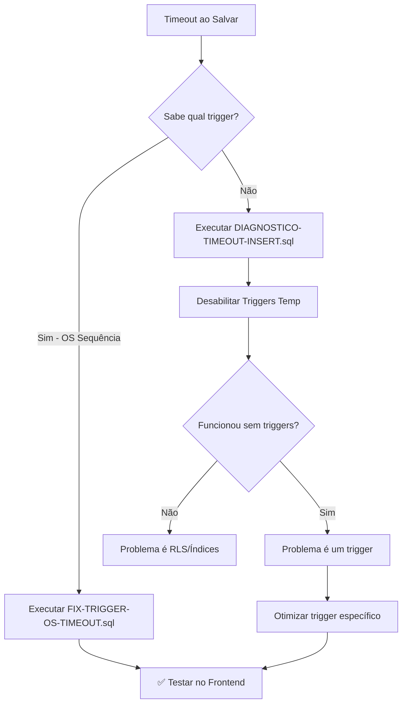

# 🚨 GUIA: Resolver Timeout ao Salvar Pedido

## 📋 Problema Identificado

```
Error: 500 Internal Server Error
Code: 57014 - "canceling statement due to statement timeout"
```

**Causa Provável:** Trigger `pedidos_sync_os_sequencia` está fazendo `generate_series` em cada INSERT, causando timeout.

---

## ✅ Solução Recomendada (Opção 1 - Mais Rápida)

### **Otimizar Trigger de OS Sequência**

**Arquivo:** `database/FIX-TRIGGER-OS-TIMEOUT.sql`

**O que faz:**

- Remove o `generate_series` que preenche gaps em tempo real
- Simplifica trigger para apenas inserir o número atual
- Gaps podem ser preenchidos depois por job separado

**Como executar:**

1. Abra **Supabase Dashboard** → **SQL Editor**
2. Cole o conteúdo de `FIX-TRIGGER-OS-TIMEOUT.sql`
3. Execute
4. Teste criar pedido novamente

---

## 🔬 Diagnóstico Detalhado (Opção 2)

Se quiser investigar **qual trigger** está causando o problema:

### **1. Executar Diagnóstico Completo**

```sql
-- Arquivo: database/DIAGNOSTICO-TIMEOUT-INSERT.sql
```

Mostra:

- Todos os triggers ativos
- Todas as policies RLS
- Índices existentes
- Foreign keys

### **2. Desabilitar Triggers Temporariamente**

```sql
-- Arquivo: database/DESABILITAR-TRIGGERS-PEDIDOS-TEMP.sql
```

Desabilita todos os triggers para testar

### **3. Testar no Frontend**

Se funcionar sem triggers = problema é um trigger pesado

### **4. Habilitar Novamente**

```sql
-- Arquivo: database/HABILITAR-TRIGGERS-PEDIDOS.sql
```

Reabilita os triggers após o teste

---

## 📊 Triggers Conhecidos que Podem Causar Timeout

| Trigger                     | Função                        | Impacto                             |
| --------------------------- | ----------------------------- | ----------------------------------- |
| `pedidos_sync_os_sequencia` | `trigger_sync_os_sequencia()` | ⚠️ **ALTO** - Usa `generate_series` |
| `trigger_pedidos_timeline`  | `inserir_timeline_pedido()`   | ✅ Leve - Apenas 1 INSERT           |

---

## 🎯 Fluxo Recomendado



---

## 📝 Arquivos Criados

1. ⭐ **FIX-TRIGGER-OS-TIMEOUT.sql** - Otimiza trigger de OS (RECOMENDADO)
2. **DIAGNOSTICO-TIMEOUT-INSERT.sql** - Diagnóstico completo
3. **DESABILITAR-TRIGGERS-PEDIDOS-TEMP.sql** - Desabilita triggers para teste
4. **HABILITAR-TRIGGERS-PEDIDOS.sql** - Reabilita após teste

---

## 🚀 Execução Rápida

**Se tiver certeza que é o trigger de OS:**

```bash
Execute: database/FIX-TRIGGER-OS-TIMEOUT.sql
```

**Se quiser diagnosticar primeiro:**

```bash
1. Execute: database/DIAGNOSTICO-TIMEOUT-INSERT.sql
2. Analise os resultados
3. Execute: database/DESABILITAR-TRIGGERS-PEDIDOS-TEMP.sql
4. Teste criar pedido
5. Execute: database/HABILITAR-TRIGGERS-PEDIDOS.sql
```

---

## ✅ Checklist

- [ ] **Executar FIX-TRIGGER-OS-TIMEOUT.sql** ← COMECE AQUI
- [ ] Testar criar pedido no frontend
- [ ] Se ainda der timeout, executar diagnóstico completo
- [ ] ✅ Funcionando!

---

## 🐛 Se o Problema Persistir

O timeout pode ser causado por:

1. ✅ **Trigger pesado** (mais provável - já corrigido)
2. ⚠️ **RLS policies complexas** (menos provável)
3. ⚠️ **Falta de índices** (raro)
4. ⚠️ **Foreign keys sem índices** (raro)

Execute o diagnóstico completo para investigar.
