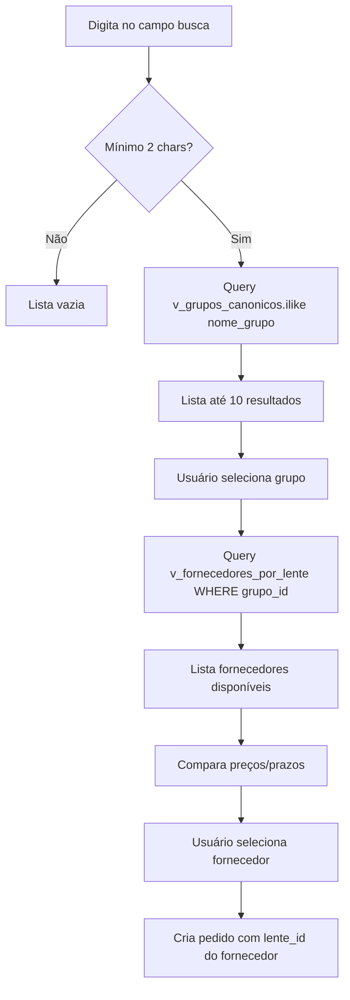

# 📊 Análise Completa: SisLens - Sistema de Filtros e Arquitetura

## 🎯 Objetivo

Documentar a arquitetura do SisLens (app em produção) para reutilizar filtros e estrutura de views no Desenrola DCL.

---

## 🏗️ Arquitetura de Dados

### Views Principais

#### 1. **vw_lentes_catalogo** (1.411 lentes físicas)

- **Propósito**: Busca completa de lentes individuais com todos os detalhes
- **Uso**: Módulo "Buscar Lentes" - busca avançada com filtros
- **Campos chave**:
  - `nome_comercial` (nome exibível da lente)
  - Especificações ópticas completas (grau, cilindro, adição, etc.)
  - Tratamentos (AR, Blue, UV, fotossensível, polarizado)
  - Tecnologias (digital, free_form, indoor, drive)
  - Preços (custo_base, preco_tabela, preco_fabricante)
  - Status (disponível, destaque, novidade)

#### 2. **vw_canonicas_genericas** (187 grupos standard)

- **Propósito**: Grupos canônicos de lentes **SEM marca específica**
- **Uso**: Catálogo Standard - lentes genéricas agrupadas
- **Campos chave**:
  - `nome_canonico` (NOT nome_comercial!)
  - Agregações: total_lentes, marcas_disponiveis[], preco_medio
  - Estatísticas: lentes_ativas, total_marcas
  - Faixas ópticas (min/max de grau)

#### 3. **vw_canonicas_premium** (250 grupos premium)

- **Propósito**: Grupos canônicos de lentes **COM marca específica**
- **Uso**: Catálogo Premium - lentes de marcas renomadas
- **Campos chave**:
  - `nome_canonico` + `marca_nome` + `linha_produto`
  - Mesma estrutura de agregações que genéricas
  - Diferencial: vinculado a marcas premium

#### 4. **vw_detalhes_premium** / **vw_detalhes_genericas**

- **Propósito**: Detalhes das lentes físicas dentro de cada canônica
- **Uso**: Comparação de fornecedores/laboratórios para um grupo
- **Campos chave**: Expande canônica mostrando todas as lentes reais disponíveis

---

## 🎨 Sistema de Filtros

### Filtros Standard (vw_canonicas_genericas)

```typescript
interface FiltrosCatalogoStandard {
  // Busca textual
  busca: string; // filtra por nome_canonico (local, client-side)

  // Tipo de Lente
  tipo: "visao_simples" | "multifocal" | "bifocal" | "leitura" | "ocupacional";

  // Material
  material:
    | "CR39"
    | "POLICARBONATO"
    | "TRIVEX"
    | "HIGH_INDEX"
    | "VIDRO"
    | "ACRILICO";

  // Índice de Refração (implícito no material, não mostrado como filtro separado)
}
```

**Implementação Real (Svelte)**:

```svelte
<Input label="Buscar" bind:value={filtroBusca} placeholder="Nome da lente..." />

<Select label="Tipo" bind:value={filtroTipo} on:change={carregarDados}
  options={[
    { value: "", label: "Todos" },
    { value: "visao_simples", label: "Visão Simples" },
    { value: "multifocal", label: "Multifocal" },
    { value: "bifocal", label: "Bifocal" },
  ]}
/>

<Select label="Material" bind:value={filtroMaterial} on:change={carregarDados}
  options={[
    { value: "", label: "Todos" },
    { value: "CR39", label: "CR39" },
    { value: "POLICARBONATO", label: "Policarbonato" },
    { value: "TRIVEX", label: "Trivex" },
    { value: "HIGH_INDEX", label: "High Index" },
  ]}
/>
```

### Filtros Premium (vw_canonicas_premium)

```typescript
interface FiltrosCatalogoPremium {
  // Busca textual
  busca: string; // filtra por nome_canonico, marca_nome, linha_produto

  // Marca (dropdown dinâmico)
  marca: string; // extraído dinamicamente: [...new Set(canonicas.map(c => c.marca_nome))]

  // Tipo de Lente
  tipo: "visao_simples" | "multifocal" | "bifocal";
}
```

**Implementação Real (Svelte)**:

```svelte
<Input label="🔍 Buscar" bind:value={filtroBusca}
  placeholder="Nome, marca ou linha..." />

<Select label="🏭 Marca" bind:value={filtroMarca}
  options={[
    { value: '', label: 'Todas as marcas' },
    ...marcasUnicas.map(m => ({ value: m, label: m }))
  ]}
/>

<Select label="👓 Tipo de Lente" bind:value={filtroTipo} on:change={carregarDados}
  options={[
    { value: '', label: 'Todos os tipos' },
    { value: 'visao_simples', label: 'Visão Simples' },
    { value: 'multifocal', label: 'Multifocal' },
    { value: 'bifocal', label: 'Bifocal' }
  ]}
/>
```

---

## 🔍 Busca Inteligente

### Funções RPC (Stored Procedures)

#### 1. **buscar_lentes_texto** (Full Text Search)

```sql
CREATE FUNCTION buscar_lentes_texto(busca text)
RETURNS SETOF vw_lentes_catalogo
```

- Busca "Google-like" em múltiplos campos
- Suporta busca parcial e tolerante a erros
- Retorna lentes completas rankeadas por relevância

#### 2. **buscar_lentes_por_receita** (Prescription Match)

```sql
CREATE FUNCTION buscar_lentes_por_receita(
  p_esferico numeric,
  p_cilindrico numeric,
  p_adicao numeric,
  p_tipo_lente text
)
RETURNS TABLE(...)
```

- Match inteligente de receita com ranges ópticos
- Verifica se grau entra nas faixas da lente
- Prioriza lentes compatíveis

---

## 📊 Cards de Exibição

### Card Standard (Canônica Genérica)

```
┌─────────────────────────────────────────┐
│ [Gradient Header]                       │
│ POLICARBONATO 1.59 Visão Simples +UV    │ ← nome_canonico
└─────────────────────────────────────────┘
│ Tipo: Visão Simples   Material: POLI   │
│ Índice: 1.59          Categoria: Std    │
├─────────────────────────────────────────┤
│ 🔵 UV  ✨ AR  🔷 Blue                   │ ← Badges tratamentos
├─────────────────────────────────────────┤
│ Esférico: -10 a +6                      │
│ Cilíndrico: 0 a -2                      │
│ Adição: +0 a +0                         │
├─────────────────────────────────────────┤
│ Lentes: 1    Marcas: 1                  │
│ Preço Médio: R$ 250,00                  │
│ Faixa: R$ 250,00 - R$ 250,00            │
└─────────────────────────────────────────┘
```

### Card Premium (Canônica Premium)

```
┌─────────────────────────────────────────┐
│ [Gradient Indigo Header]  🏭 HOYA   ⭐  │ ← marca_nome + super_premium
│ CR39 1.74 Multifocal +UV +Foto          │ ← nome_canonico
│ Linha: HiVision LongLife                │ ← linha_produto
└─────────────────────────────────────────┘
│ Tipo: Multifocal      Material: CR39    │
│ Índice: 1.74          Categoria: Premium│
├─────────────────────────────────────────┤
│ ✨ AR  🔵 Blue  ☀️ Foto  🕶️ Polar       │
├─────────────────────────────────────────┤
│ Esférico: -13 a +10                     │
│ Cilíndrico: -6 a 0                      │
│ Adição: +0.5 a +4.5                     │
├─────────────────────────────────────────┤
│ Lentes Ativas: 3                        │
│ Preço Médio: R$ 9.123,76                │
│ Faixa: R$ 8.623,17 - R$ 9.561,78       │
└─────────────────────────────────────────┘
```

---

## 🎯 Recomendações para Desenrola DCL

### 1. **Busca de Lentes no Wizard** (Passo 1)

**Usar**: `v_grupos_canonicos` (equivalente a vw_canonicas_genericas)

**Query corrigida**:

```typescript
const { data, error } = await lentesClient
  .from("v_grupos_canonicos")
  .select("*")
  .ilike("nome_grupo", `%${termo}%`) // ✅ CORRETO (não nome_comercial)
  .limit(10);
```

**Filtros sugeridos** (opcional para v2):

```typescript
// Filtro por tipo (visão simples, multifocal, etc)
.eq('tipo_lente', tipoSelecionado)

// Filtro por material (CR39, policarbonato, etc)
.eq('material', materialSelecionado)

// Filtro por tratamento (blue light, fotossensível)
.eq('blue_light', true)
.neq('fotossensivel', 'nenhum')
```

### 2. **Exibição de Resultados**

**Campos a mostrar**:

```typescript
interface GrupoCanonicoCard {
  // Header
  nome_grupo: string; // "CR39 1.56 Visão Simples +AR +UV"

  // Specs
  tipo_lente: string; // "visão_simples" → exibir "Visão Simples"
  material: string; // "CR39"
  indice_refracao: string; // "1.56"

  // Tratamentos (badges)
  ar: boolean;
  blue_light: boolean;
  uv400: boolean;
  fotossensivel: string; // 'nenhum' | 'transitions' | ...

  // Faixas ópticas
  esferico_min: number; // -8.00
  esferico_max: number; // +6.00
  cilindrico_min: number; // -2.25
  cilindrico_max: number; // -4.00
  adicao_min: number; // +0
  adicao_max: number; // +0

  // Estatísticas
  preco_minimo: number; // 253.91
  preco_medio: number; // 265.64
  preco_maximo: number; // 281.29
}
```

### 3. **Busca de Fornecedores** (Passo 2)

**Usar**: `v_fornecedores_por_lente` (equivalente a vw_detalhes_genericas)

```typescript
const { data: fornecedores } = await lentesClient
  .from("v_fornecedores_por_lente")
  .select("*")
  .eq("grupo_id", grupoSelecionado.grupo_id)
  .eq("disponivel", true)
  .order("preco_tabela", { ascending: true });
```

**Comparação de fornecedores**:

```typescript
interface FornecedorComparacao {
  fornecedor_nome: string; // "Hoya", "Essilor", etc
  marca_nome: string; // "Transitions", "Crizal", etc
  preco_tabela: number; // Preço unitário
  prazo_entrega: number; // Dias úteis
  disponivel: boolean;

  // Diferenciais
  linha_produto?: string; // "HiVision LongLife"
  destaque: boolean;
  novidade: boolean;
}
```

### 4. **Workflow Completo**



---

## 🔧 Implementação Sugerida

### Componente de Busca (Autocomplete)

```tsx
<div className="relative">
  <Input
    label="🔍 Buscar Lente"
    value={termoBusca}
    onChange={(e) => handleBuscarLentes(e.target.value)}
    placeholder="Digite tipo, material ou tratamento..."
  />

  {lentesEncontradas.length > 0 && (
    <div className="absolute z-50 w-full mt-1 bg-white rounded-lg shadow-xl">
      {lentesEncontradas.map((lente) => (
        <button
          key={lente.grupo_id}
          onClick={() => selecionarLente(lente)}
          className="w-full p-4 hover:bg-blue-50 text-left"
        >
          <div className="font-semibold">{lente.nome_grupo}</div>
          <div className="text-sm text-gray-600">
            {lente.tipo_lente} • {lente.material} {lente.indice_refracao}
          </div>
          <div className="flex gap-1 mt-1">
            {lente.ar && <Badge>AR</Badge>}
            {lente.blue_light && <Badge>Blue</Badge>}
            {lente.uv400 && <Badge>UV</Badge>}
          </div>
        </button>
      ))}
    </div>
  )}
</div>
```

### Comparador de Fornecedores

```tsx
<div className="grid grid-cols-1 md:grid-cols-2 lg:grid-cols-3 gap-4">
  {fornecedores.map((f) => (
    <Card
      key={f.lente_id}
      className={lenteEscolhida === f.lente_id ? "ring-2 ring-blue-500" : ""}
      onClick={() => setLenteEscolhida(f.lente_id)}
    >
      <CardHeader>
        <div className="flex justify-between items-start">
          <div>
            <h3 className="font-bold">{f.fornecedor_nome}</h3>
            {f.marca_nome && (
              <p className="text-sm text-gray-600">{f.marca_nome}</p>
            )}
          </div>
          {f.destaque && <Badge variant="warning">⭐ Destaque</Badge>}
        </div>
      </CardHeader>

      <CardContent>
        <div className="text-2xl font-bold text-green-600">
          R$ {f.preco_tabela.toFixed(2)}
        </div>
        <div className="text-sm text-gray-600 mt-1">
          Prazo: {f.prazo_entrega || "5-7"} dias úteis
        </div>

        {f.linha_produto && (
          <div className="mt-2 text-xs bg-blue-50 px-2 py-1 rounded">
            {f.linha_produto}
          </div>
        )}
      </CardContent>
    </Card>
  ))}
</div>
```

---

## 📝 Checklist de Implementação

- [x] Corrigir query de busca: `nome_comercial` → `nome_grupo`
- [ ] Implementar autocomplete com debounce (300ms)
- [ ] Adicionar filtros opcionais (tipo, material)
- [ ] Criar componente GrupoCanonicoCard
- [ ] Implementar busca de fornecedores por grupo_id
- [ ] Criar comparador de fornecedores com grid
- [ ] Adicionar indicadores visuais (destaque, novidade)
- [ ] Implementar seleção de fornecedor e criação de pedido
- [ ] Testar fluxo completo: busca → seleção → fornecedor → pedido

---

## 🎯 Próximos Passos

1. **Corrigir query imediata**: `nome_grupo` no handleBuscarLentes
2. **Testar busca**: Verificar se retorna resultados corretos
3. **Implementar autocomplete melhorado**: Dropdown com cards
4. **Adicionar step 1.5**: Exibir detalhes do grupo selecionado
5. **Implementar step 2 real**: Buscar fornecedores do grupo
6. **Criar tabela de comparação**: Preço × Prazo × Marca
7. **Finalizar wizard**: Integrar seleção com criação de pedido

---

**Gerado em**: 16/01/2026
**Fonte**: D:/projetos/sis_lens/src (app em produção)
**App online**: https://sislens.netlify.app/
