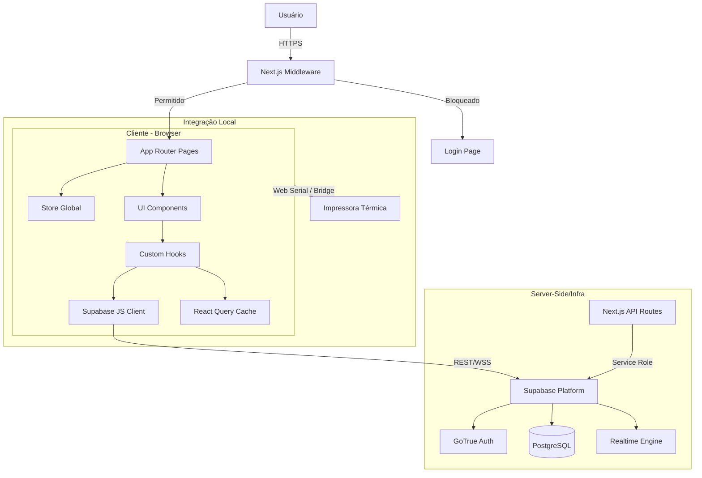

# Blueprint Completo do Sistema: Desenrola DCL

**Data de Geração:** 23 de Janeiro de 2026
**Versão Documentada:** 1.0 (Pós-Build Estável)

---

## 1. Visão Geral e Arquitetura

O **Desenrola DCL** é uma plataforma de gestão integrada para redes de ópticas, focada na otimização do fluxo de pedidos, controle de produção (laboratórios/montagem) e gamificação de tarefas de loja.

### Stack Tecnológico

- **Frontend**: Next.js 14.2 (App Router)
- **Linguagem**: TypeScript 5.3
- **Estilização**: Tailwind CSS + shadcn/ui + Radix UI
- **Database**: PostgreSQL (supérfluo via Supabase)
- **Auth**: Supabase Auth (JWT + Cookies)
- **Estado Global**: Zustand
- **Data Fetching**: TanStack Query (React Query) v5
- **Impressão**: Driver Customizado ESC/POS (Web Serial + Web Socket Bridge)

### Diagrama de Arquitetura Lógica

---

## 2. Estrutura de Banco de Dados (PostgreSQL)

O banco de dados é o coração do sistema, utilizando RLS (Row Level Security) para garantir isolamento multi-tenant (lojas).

### Tabelas Principais

#### 2.1. Núcleo de Negócio

- **`pedidos`**: Tabela central do sistema.
  - **PK**: `id` (UUID)
  - **FKS**: `loja_id`, `laboratorio_id`, `cliente_id`, `montador_id`, `fornecedor_lente_id`
  - **Dados Ópticos**: `esferico_od`, `cilindrico_od`, `eixo_od`, `adicao_od`, etc.
  - **Financeiro**: `valor_pedido`, `custo_lentes`, `custo_montagem`, `margem_lente_percentual`
  - **Status**: Controle de funil (`REGISTRADO`, `PRODUCAO`, `ENTREGUE`, etc.)
  - **Datas Críticas**: `data_pedido`, `data_prevista_pronto`, `data_sla_laboratorio`

#### 2.2. Entidades Organizacionais

- **`lojas`**: Unidades de negócio.
  - Colunas: `nome`, `slug`, `cidade`, `ativo`.
- **`laboratorios`**: Parceiros de produção de lentes.
  - Colunas: `nome`, `ativo`, `sla_padrao_horas`.
- **`montadores`**: Responsáveis pela montagem física.
  - Colunas: `nome`, `tipo` (interno/externo), `preco_padrao`.

#### 2.3. Controle e Gamificação (Mission Control)

- **`loja_configuracoes_horario`**: Define horários de funcionamento e deadlines de missões.
- **`loja_acoes_customizadas`**: Regras de pontuação e tarefas diárias específicas por loja.
- **`mission_control_logs`**: (Inferido) Histórico de pontuação e cumprimento de metas.

### Segurança (RLS)

Todas as tabelas críticas possuem Policies ativadas:

1.  **Select**: Usuário só vê dados da sua `loja_id` (exceto Admins/Gestores).
2.  **Insert/Update**: Validado via trigger ou policy para garantir integridade do tenant.

---

## 3. Frontend e Fluxos de Usuário

### 3.1. Roteamento e Proteção (`src/middleware.ts`)

O sistema utiliza um middleware robusto para controle de acesso baseado em Roles (RBAC).

| Role         | Permissões Principais   | Rotas Típicas                                 |
| :----------- | :---------------------- | :-------------------------------------------- |
| `gestor`     | Acesso Total            | `/dashboard`, `/configuracoes`, `/relatorios` |
| `dcl`        | Operacional Avançado    | `/kanban`, `/pedidos`, `/alertas`             |
| `financeiro` | Visualização Financeira | `/dashboard`, `/pedidos` (readonly)           |
| `loja`       | Operacional Básico      | `/kanban` (apenas sua loja), `/novo-pedido`   |

### 3.2. Módulos Principais

#### A. Wizard de Novo Pedido (`src/components/forms/NovaOrdemWizard.tsx`)

Um formulário complexo em etapas (Stepper) para garantir consistência dos dados.

- **Etapa 1**: Seleção de Cliente e Loja.
- **Etapa 2**: Receita (Dioptrias, Cilindro, Eixo).
- **Etapa 3**: Escolha da Lente (Integração com catálogo).
- **Etapa 4**: Escolha da Armação.
- **Etapa 5**: Montagem e Serviços.
- **Etapa 6**: Financeiro e Pagamento.
- **Etapa 7**: Confirmação e Impressão.

**Destaque Técnico**: O estado do wizard é mantido localmente até a submissão final ao Supabase. A etapa 7 recebe o ID do pedido criado para permitir a impressão imediata.

#### B. Kanban de Produção (`src/app/kanban`)

Visualização visual do fluxo de produção.

- **Drag & Drop**: Utiliza `@hello-pangea/dnd`.
- **Colunas Dinâmicas**: Mapeadas dos status do banco de dados.
- **Cards Ricos**: Mostram SLA, atrasos (badges vermelhos) e dados do cliente.
- **Filtros**: Por Loja, Laboratório ou Busca Textual.

#### C. Dashboard de KPIs (`src/app/dashboard`)

Visualização gerencial de alto nível.

- **Gráficos**: Recharts para evolução de vendas.
- **Métricas**: Ticket Médio, Total Vendido, % de Atraso.
- **Fonte de Dados**: Views otimizadas no banco (`view_dashboard_kpis`).

#### D. Impressão Térmica (`src/lib/utils/thermal-printer.ts`)

Módulo recém-implementado para emissão de comprovantes não fiscais.

- **Driver**: Implementação pura de comandos ESC/POS em TypeScript.
- **Conectividade**:
  1.  **Direct USB**: Via Web Serial API (Chrome/Edge).
  2.  **Bridge**: Via WebSocket para servidor local Node.js (`scripts/print-bridge-server.js`).
  3.  **Download**: Geração de arquivo `.prn` para spooler.

---

## 4. Estado e Gerenciamento de Dados

### 4.1. Zustand Stores (`src/lib/stores`)

- **`useAuth`**: Sessão do usuário, role e loja atual.
- **`usePedidosStore`**: Cache local dos pedidos do Kanban, filtros ativos e loading states.
- **`useConfig`**: Configurações de UI (tema, preferências).

### 4.2. React Query

Utilizado para cacheamento server-state e revalidação inteligente.

- Key Factory: `['pedidos', loja_id]`, `['dashboard', period]`.
- Stale Time: Configurado para evitar refetching agressivo (ex: 5 minutos para catálogos).

### 4.3. API Routes (`src/app/api`)

Backend-for-Frontend (BFF) pattern.

- `/api/auth/*`: Endpoints para login/logout e refresh token.
- `/api/pedidos`: Busca complexa com filtros server-side.
- `/api/dashboard`: Agregação de dados para performance.

---

## 5. Infraestrutura e DevTools

### 5.1. Variáveis de Ambiente

Requeridas para funcionamento:

- `NEXT_PUBLIC_SUPABASE_URL`: URL do projeto Supabase.
- `NEXT_PUBLIC_SUPABASE_ANON_KEY`: Chave pública para cliente.
- `SUPABASE_SERVICE_ROLE_KEY`: (Server-only) Para tarefas administrativas.

### 5.2. Scripts Utilitários

- **`npm run build`**: Compilação Next.js (SSG/SSR).
- **`node scripts/print-bridge-server.js`**: Servidor de ponte para impressão em rede/USB legado.
- **SQL Scripts (`/database`)**: Biblioteca vasta de correções, diagnósticos e migrações manuais.

---

## 6. Pontos de Atenção e Manutenção

1.  **Migrações de Banco**: Atualmente manuais. Recomendado analisar a pasta `database/` antes de qualquer alteração de schema.
2.  **Impressão**: Requer configuração de margens e largura (58mm vs 80mm) no componente `PrintOrderButton`.
3.  **Timezones**: O sistema opera com lógica de fuso horário (SP) para renovação de missões diárias. Verificar sempre `UTC` vs `Local Time` nas queries.
4.  **Permissões**: Ao criar novas rotas, adicionar EXPLICITAMENTE em `src/middleware.ts` para evitar acesso indevido.

---

**Conclusão**: O sistema Desenrola DCL possui uma arquitetura moderna e escalável, baseada em serviços gerenciados (Supabase/Vercel) e frontend rico. O código está modularizado e tipado, facilitando manutenção evolutiva.
