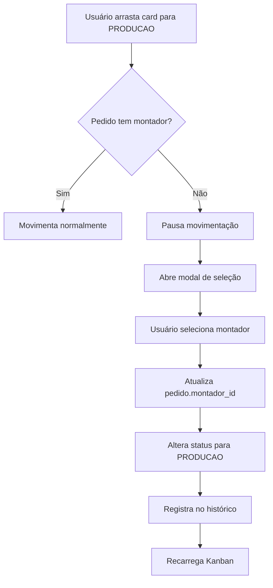

# 🔧 Seleção de Montador no Kanban

## 📋 Resumo da Funcionalidade

Implementação de trava obrigatória para seleção de montador ao mover pedidos para o status **PRODUCAO** no Kanban.

## 🎯 Comportamento

Quando um cartão é arrastado (drag & drop) para a coluna **"Em Produção"**:

1. **Se o pedido JÁ TEM montador atribuído**: A movimentação ocorre normalmente
2. **Se o pedido NÃO TEM montador**:
   - A movimentação é pausada
   - Um modal é exibido solicitando a seleção do montador
   - O usuário escolhe entre os montadores disponíveis
   - Após confirmação, o montador é atribuído E o pedido é movido para produção

## 🗄️ Estrutura de Dados

### Tabela: `montadores`

```sql
CREATE TABLE public.montadores (
  id UUID PRIMARY KEY DEFAULT gen_random_uuid(),
  nome TEXT NOT NULL,
  tipo TEXT NOT NULL CHECK (tipo IN ('INTERNO', 'LABORATORIO')),
  laboratorio_id UUID REFERENCES laboratorios(id),
  ativo BOOLEAN DEFAULT true,
  created_at TIMESTAMPTZ DEFAULT NOW()
);
```

**Tipos de Montador:**

- `INTERNO`: Montadores da própria ótica
- `LABORATORIO`: Montadores vinculados a laboratórios parceiros

### Campo no Pedido

A tabela `pedidos` já possui o campo:

- `montador_id`: UUID (nullable) - Referência ao montador responsável

## 📁 Arquivos Criados/Modificados

### 1. Hook: `use-montadores.ts`

**Localização:** `src/hooks/use-montadores.ts`

```typescript
// Busca montadores ativos usando TanStack Query
export function useMontadores() {
  // Retorna lista de montadores com cache de 5 minutos
}
```

**Funcionalidades:**

- Query automática com cache
- Filtro apenas montadores ativos
- Ordenação por nome
- Integração com Supabase

### 2. Componente: `MontadorSelectorDialog.tsx`

**Localização:** `src/components/kanban/MontadorSelectorDialog.tsx`

**Props:**

```typescript
interface MontadorSelectorDialogProps {
  open: boolean;
  onOpenChange: (open: boolean) => void;
  onSelect: (montadorId: string) => void;
  pedidoNumero?: string;
}
```

**Recursos:**

- Modal responsivo com shadcn/ui
- Lista visual de montadores com badges de tipo
- Seleção com feedback visual
- Loading states e error handling
- Botão de confirmação desabilitado até seleção

### 3. Lógica no Kanban: `page.tsx`

**Localização:** `src/app/kanban/page.tsx`

**Alterações principais:**

#### Estados adicionados:

```typescript
const [showMontadorDialog, setShowMontadorDialog] = useState(false);
const [pendingMove, setPendingMove] = useState<{
  pedido: PedidoCompleto;
  destination: string;
  source: string;
} | null>(null);
```

#### Função `handleDragEnd` modificada:

```typescript
// Intercepta movimentação para PRODUCAO
if (destination.droppableId === "PRODUCAO" && !pedido.montador_id) {
  setPendingMove({ pedido, destination, source });
  setShowMontadorDialog(true);
  return; // Pausa a movimentação
}
```

#### Função auxiliar `executarMovimentacao`:

```typescript
// Centraliza lógica de movimentação
// Aceita montadorId opcional para atribuição
async function executarMovimentacao(
  pedido,
  destinationStatus,
  sourceStatus,
  montadorId?
);
```

#### Handler de seleção:

```typescript
const handleMontadorSelected = async (montadorId: string) => {
  // Completa a movimentação pendente com montador atribuído
};
```

## 🔄 Fluxo de Execução



## 🎨 Interface do Modal

**Estrutura visual:**

```
┌─────────────────────────────────────┐
│  👤 Selecionar Montador             │
│  Escolha o responsável pelo #123   │
├─────────────────────────────────────┤
│  ┌───────────────────────────────┐  │
│  │ ✓ João Silva                  │  │
│  │   [👤 Interno]                │  │
│  └───────────────────────────────┘  │
│  ┌───────────────────────────────┐  │
│  │   Maria Santos                │  │
│  │   [👤 Interno]                │  │
│  └───────────────────────────────┘  │
│  ┌───────────────────────────────┐  │
│  │   Equipe Essilor              │  │
│  │   [🏢 Laboratório]            │  │
│  └───────────────────────────────┘  │
├─────────────────────────────────────┤
│  [Cancelar]  [Confirmar Montador]  │
└─────────────────────────────────────┘
```

## 📊 Setup Inicial

### 1. Execute o script SQL:

```bash
# No Supabase SQL Editor
psql < database/setup-montadores-iniciais.sql
```

### 2. Montadores de exemplo criados:

- **Internos:** João Silva, Maria Santos, Pedro Oliveira
- **Laboratórios:** Equipes Essilor, Zeiss, Hoya (se labs existirem)

### 3. Verificação:

```sql
SELECT m.nome, m.tipo, l.nome as laboratorio
FROM montadores m
LEFT JOIN laboratorios l ON m.laboratorio_id = l.id
WHERE m.ativo = true;
```

## 🔒 Permissões e Segurança

- ✅ RLS da tabela `montadores` permite leitura para todos usuários autenticados
- ✅ Apenas gestores podem inserir/editar montadores
- ✅ Modal bloqueia movimentação até seleção válida
- ✅ Validação de permissões mantida no middleware

## 🧪 Como Testar

1. **Acesse o Kanban:** `/kanban`
2. **Crie um novo pedido** ou use um existente em status anterior a PRODUCAO
3. **Arraste o card para "Em Produção"**
4. **Verifique:**
   - Modal aparece automaticamente
   - Lista de montadores é carregada
   - Seleção é obrigatória
   - Após confirmar, card é movido

## 🎯 Casos de Uso

### Caso 1: Novo Pedido em Produção

```
1. Pedido está em "Pago"
2. Drag para "Em Produção"
3. Modal solicita montador
4. Selecionar "João Silva"
5. Confirmar
→ Pedido move + montador atribuído
```

### Caso 2: Pedido com Montador Pré-definido

```
1. Pedido já tem montador (definido anteriormente)
2. Drag para "Em Produção"
→ Move diretamente, sem modal
```

### Caso 3: Cancelar Seleção

```
1. Modal aparece
2. Usuário clica "Cancelar" ou fora do modal
→ Pedido permanece no status original
```

## 📝 Observações

- **Performance:** Hook usa cache de 5 minutos (TanStack Query)
- **UX:** Modal aparece instantaneamente, sem delay perceptível
- **Fallback:** Se tabela montadores estiver vazia, modal exibe alerta
- **Histórico:** Movimentação é registrada com observação sobre montador atribuído

## 🔮 Melhorias Futuras

- [ ] Adicionar filtro de montadores por laboratório do pedido
- [ ] Permitir reatribuição de montador diretamente no drawer de detalhes
- [ ] Dashboard de produtividade por montador
- [ ] Notificação ao montador quando pedido é atribuído
- [ ] Gamificação de pontos por pedidos concluídos

## 🆘 Troubleshooting

**Modal não aparece:**

- Verificar se tabela `montadores` existe
- Conferir RLS policies da tabela

**Lista vazia no modal:**

- Executar `setup-montadores-iniciais.sql`
- Verificar se há montadores com `ativo = true`

**Erro ao confirmar:**

- Checar permissões do usuário
- Validar conexão Supabase
- Ver logs do console do navegador
